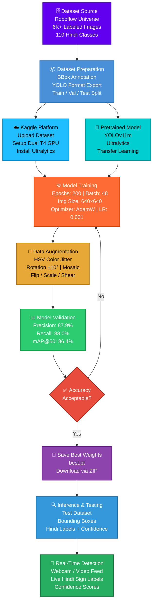

# **Indian-Sign-Language-Detection**

**Frameworks & Libraries:- **


**Platforms:- **


**License:- **


A College Deeplearning Project build Sign Detection in Hindi langauge annotation.

## 📓 Training Notebook

The full model training pipeline can be found here:

[Open Notebook](notebook/Indian Sign Language Detection.ipynb)

## **Project Overview**

In this project, I build a real time hand sign detection which shows hindi labels with confidence score using transfer learning (pretrained yolo v11 model) using dataset from Roboflow and fine tune train on Kaggle platform.

The main goal of this project is to:-

- Helps to understand the sign langauge in hindi for people who don't know hand sign langauge.

## **Features**

- Real-time hand sign detection.
- Bounding Box labeled objects with confidence.
- Supports classification of 100+ classes.

## **Implementation**

Project implementation started with dataset preparation and ending with real time detection results.The entire workflow uses platform Kaggle for training and Roboflow Universe for data prepation.

### 1. **Dataset Integration**

- The dataset was used from Roboflow which consists on 110 classes with hindi annotations.
- Each image was annotated with bounding boxes marking the location of objects.
- The dataset was exported in YOLO compatible format (with training, validation, and test splits).
- The dataset was uploaded in my kaggle dataset section to load into jupyter notebook for model training.

### 2. **Environment Setup**
 
- In Kaggle, I installed the Ultralytics Library to use YOLO.
- Setup the dual GPU (T4  2) for training runtime.
-	Model was evaluted on val datasplit.
- Model ran on test datasplit to product bounding box with label, confidence score images.
-	Zipped the output folder to made it downloadable to save on local machine. 

### 3. **Model Training**
 
We fine-tuned the pre-trained YOLOv11m model from Ultralytics using transfer learning, optimized for real-time performance, speed, and accuracy on dual NVIDIA T4 GPUs.

- Training parameters:-

| Parameter |	Value |	Purpose |
|------|--------|--------|
|Epochs / Batch	|200 / 48	    |Stable convergence, optimized for dual T4 GPU memory |
|Img Size	      |640 × 640	  |Balanced trade-off between detail and inference speed |
|Optimizer	    |AdamW	      |Momentum 0.9, weight decay 0.0005 for regularization |
|Learning Rate	|0.001 → 0.01	|Cosine decay (cos_lr=True) with a 3-epoch warmup |
|Loss Weights	  |box=7.5, cls=1.5	| Tightens bounding boxes and handles class imbalance |

- Data Augmentation Strategy:- To ensure robustness against real-world lighting and camera angles, the following augmentations were applied:
  
  - Color (HSV):= Hue (±0.015), Saturation (±0.7), and Brightness (±0.4) variations.
  - Geometry:- Rotation (±10°), translation (±10%), scale/zoom (±50%), shear (±10°), perspective (0.001), and horizontal flip (50% probability).
  - Context:- Mosaic (1.0) combining 4 training images to improve small-object/hand gesture detection.

### 4. Model Validation
The model was evaluated on a dedicated validation split to assess generalization to unseen data. The key evaluation metrics used include:

- Precision: Percentage of predicted detections that were correct.
- Recall: Percentage of actual hand gestures successfully detected.
- mAP@50: Mean Average Precision calculated at an IoU (Intersection over Union) threshold of 0.50 (measures general detection accuracy).
- mAP@50-95: Mean Average Precision calculated across a range of IoU thresholds from 0.50 to 0.95 (measures localization precision and boundary tightness).

### 5. **Inference and Output**
 
- The trained YOLOv1 model was used for inference on new test images.
- Each detected object was marked with a bounding box, label, and confidence score.
- Results showed that the model successfully detected multiple objects simultaneously and delivered accurate predictions.
- The outputs demonstrated the system’s ability to be applied in real world scenarios such as surveillance, product detection, and automation tasks.

# **Confusion Matrix & Results data**


## **WORKFLOW:- **



╔══════════════════════════════════════════════════════════════════════════════╗
║              INDIAN SIGN LANGUAGE DETECTION — WORKFLOW                      ║
╚══════════════════════════════════════════════════════════════════════════════╝

  ┌─────────────────────┐
  │   📡 DATA SOURCE    │
  │   Roboflow Universe │
  │   6K+ Images        │
  │   110 Hindi Classes │
  └──────────┬──────────┘
             │
             ▼
  ┌─────────────────────┐
  │  📦 DATA PREP       │
  │  BBox Annotation    │
  │  YOLO Format        │
  │  Train/Val/Test     │
  └──────────┬──────────┘
             │
             ▼
  ┌─────────────────────┐     ┌─────────────────────┐
  │  ☁️ KAGGLE SETUP    │────▶│  🧠 YOLOv11m BASE   │
  │  Dual T4 GPU        │     │  Pretrained Weights  │
  │  Ultralytics Lib    │     │  Transfer Learning   │
  └──────────┬──────────┘     └──────────┬──────────┘
             │                           │
             └──────────┬────────────────┘
                        │
                        ▼
           ┌────────────────────────┐
           │   ⚙️ MODEL TRAINING    │
           │  Epochs    : 200       │
           │  Batch     : 48        │
           │  Img Size  : 640×640   │
           │  Optimizer : AdamW     │
           │  LR        : 0.001     │
           │  Loss Box  : 7.5       │
           └────────────┬───────────┘
                        │
                        ▼
           ┌────────────────────────┐
           │  🎨 AUGMENTATION       │
           │  HSV Color Jitter      │
           │  Rotation ±10°         │
           │  Mosaic (4 Images)     │
           │  Flip / Scale / Shear  │
           └────────────┬───────────┘
                        │
                        ▼
           ┌────────────────────────┐
           │  📊 VALIDATION         │
           │  Precision : 87.9%     │
           │  Recall    : 88.0%     │
           │  mAP@50    : 86.4%     │
           │  mAP@50-95 : 51.0%     │
           └────────────┬───────────┘
                        │
               ┌────────▼────────┐
               │  ✅ Acceptable? │
               └────────┬────────┘
                  NO ◀──┘──▶ YES
                  │             │
                  │             ▼
                  │   ┌──────────────────┐
                  │   │  💾 SAVE WEIGHTS │
                  │   │  best.pt         │
                  │   │  Download ZIP    │
                  │   └────────┬─────────┘
                  │            │
                  └────────────┘
                               │
                               ▼
                  ┌────────────────────────┐
                  │  🔍 INFERENCE          │
                  │  Test Images           │
                  │  Bounding Boxes        │
                  │  Hindi Labels          │
                  │  Confidence Scores     │
                  └────────────┬───────────┘
                               │
                               ▼
                  ┌────────────────────────┐
                  │  🎯 REAL-TIME OUTPUT   │
                  │  Live Webcam Feed      │
                  │  Hindi Sign Labels     │
                  │  Instant Recognition   │
                  └────────────────────────┘
                  
## **Project Structure**
```
├── notebook/Indian Sign Language Detection.ipynb         # Main Jupyter Notebook

├── detect/                                               # Training & testing images

├── detect/train/weights                                  # Saved models 

├── requirements.txt                                      # Dependencies

└── README.md                                             # Project documentation
```

## ⚙️ **Tech Stack**

- `Language`:- Python
- `Frameworks/Libraries`:- Ultralytics (YOLO Framework)
- `Tools`:- Kaggle, Roboflow

## Dataset

### Dataset Source:-

https://universe.roboflow.com/mujab/sign-language-w9k46/dataset/1

Contains 6k of labeled images of sign language with hindi annotations.


## 📈 **Outputs**


## Results:

### Evaluation Metrics:-

| Metrics | Score |
|-------|--------|
|`Precision`| ~ 87.9%|
|`Recall`| ~ 88.0%|
|`mAP@50`| ~ 86.4%|
|`mAP@50–95`:| ~ 51.0%|

Correctly classifies speed limits, stop signs, and other common traffic symbols.


 

